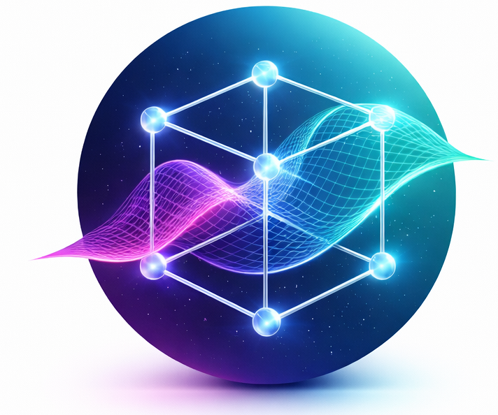

# <div align="center"> Hyperplott</div>

<div align="center">
  <h3>Pioneering the future of experimental logic through high-fidelity AI orchestration.</h3>
</div>

<p align="center">
  
  
  
  
  
</p>

---

## 🚀 Overview

**Hyperplott** is a sophisticated Design of Experiments (DoE) SaaS platform designed for researchers, scientists, and engineers. It leverages advanced AI to automate experimental design, provide high-fidelity 3D visualizations, and generate detailed statistical reports.

Built with a focus on **visual excellence**, Hyperplott features a "Midnight AI" design system with deep glassmorphism and real-time 3D rendering.

## ✨ Key Features

- **🔬 Scientific AI Engine**: Intelligent factor selection and level optimization using Google Gemini AI.
- **🧊 3D Optimization**: Interactive 3D response surfaces and factorial cube visualizations using Three.js.
- **📊 Matrix Generation**: Automated creation of Full Factorial, Box-Behnken, and Custom designs.
- **📂 Workspace Management**: Secure laboratory registry for tracking complex multi-step experiments.
- **📄 Professional Reporting**: Export results to PDF and DOCX with integrated statistical charts.
- **🛡️ Secure Sentinel**: Enterprise-grade security with Firebase authentication and real-time data sync.

## 🎨 Design System: Midnight AI

Hyperplott utilizes a custom-tailored dark theme called **Midnight Scale**:

- **Core Palette**: `#6366F1` (Primary Indigo), `#C084FC` (Secondary Purple), `#020617` (Midnight Base).
- **Glassmorphism**: High-blur, low-opacity cards for a lightweight, airy feel.
- **Animations**: Fluid micro-animations powered by Framer Motion.
- **Typography**: Inter for clarity and Space Grotesk for scientific aesthetic.

## 🛠️ tech Stack

- **Frontend**: React 18, Vite
- **Styling**: Tailwind CSS 4.0
- **3D Engine**: Three.js, React Three Fiber
- **AI**: Google Generative AI (Gemini)
- **Backend/Auth**: Firebase
- **Charts**: Recharts
- **Icons**: Lucide React

## 🏁 Getting Started

### Prerequisites

- Node.js (v18+)
- npm or yarn

### Installation

1. Clone the repository:
   ```bash
   git clone https://github.com/hyperplott-svg/Hyperplott_beta.git
   cd Hyperplott
   ```

2. Install dependencies:
   ```bash
   npm install
   ```

3. Configure Environment:
   Create a `.env` file in the root directory and add your Firebase and Gemini API credentials (refer to `.env.example` if available).

4. Launch Development Server:
   ```bash
   npm run dev
   ```

## 🌐 Deployment on Render

This project is configured for seamless deployment as a **Static Site** on [Render](https://render.com/).

### Automated Blueprint Deployment

1. Connect your GitHub repository to Render.
2. Render will automatically detect the `render.yaml` file and configure the service.
3. Fill in the required **Environment Variables** in the Render Dashboard:
   - `VITE_FIREBASE_API_KEY`
   - `VITE_FIREBASE_AUTH_DOMAIN`
   - ... (all variables listed in `render.yaml`)
   - `VITE_GEMINI_API_KEY` (or `GEMINI_API_KEY` depending on your config)

### Manual Configuration

If you prefer manual setup:
- **Runtime**: Static Site
- **Build Command**: `npm install && npm run build`
- **Publish Directory**: `dist`
- **Redirects/Rewrites**: Create a rule where `/*` rewrites to `/index.html` (for SPA routing).

## 📂 Project Structure

```text
src/
├── components/          # Reusable UI & 3D components
│   ├── 3d/              # Three.js visualizations
│   ├── landing/         # Homepage sections (Hero, Features, etc.)
│   └── layout/          # Sidebar, Header, MainLayout
├── context/             # Auth and Project contexts
├── doe/                 # Core DoE logic and design generators
├── pages/               # Main application views
└── assets/              # Static media and styles
```

## ⚖️ Legal & Privacy

By using Hyperplott, you agree to our:
- [Privacy Policy](https://www.hyperplott.com/privacy)
- [Terms & Conditions](https://www.hyperplott.com/terms)

## 📞 contact

**Company**: Hyperplott (DharaAI)
**Support**: support@hyperplott.com
**Inquiries**: privacy@hyperplott.com

---

<p align="center">© 2026 Hyperplott. All Rights Reserved. Built for the future of science.</p>
